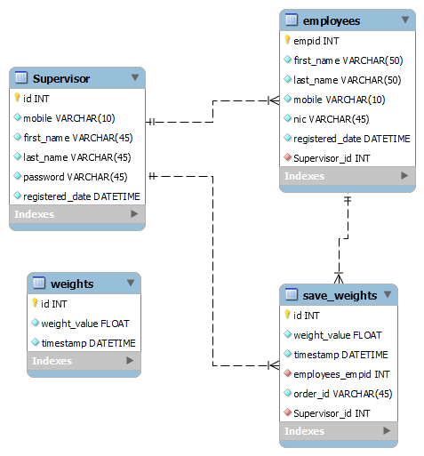

# Database Design

## Database Design Description

The following section describes the **database design** for the **Tea Weight Scale System Prototype**,This database design manages employees and records the tea weights collected by them, along with tracking orders made by employees.

**ER Diagram**: 

### **Entities and Their Attributes**

1. **Supervisor Table**:
   - **Purpose**: Stores information about supervisors who manage employees and oversee weight-related operations.
   - **Attributes**:
     - `id`: Primary key. Unique identifier for each supervisor.
     - `mobile`: Mobile number of the supervisor.
     - `first_name`: Supervisor's first name.
     - `last_name`: Supervisor's last name.
     - `password`: Encrypted password for the supervisor's account (likely used for authentication in the system).
     - `registered_date`: Date when the supervisor was added to the system.
   - **Relationships**:
     - One supervisor can manage multiple employees (**Supervisor to Employees**, one-to-many).
     - A supervisor can be associated with multiple weight entries recorded in the **Save_Weights** table.

---

2. **Employees Table**:
   - **Purpose**: Stores details about employees who perform weight-related operations and report to supervisors.
   - **Attributes**:
     - `empid`: Primary key. Unique identifier for each employee.
     - `first_name`: Employee's first name.
     - `last_name`: Employee's last name.
     - `mobile`: Mobile number of the employee.
     - `nic`: National Identification Card number of the employee (for legal/identification purposes).
     - `registered_date`: Date when the employee was added to the system.
     - `Supervisor_id`: Foreign key linking to the **Supervisor** table, indicating the supervisor responsible for the employee.
   - **Relationships**:
     - Each employee is assigned to one supervisor (**Employees to Supervisor**, many-to-one).
     - An employee can have multiple weight recordings linked in the **Save_Weights** table (**Employees to Save_Weights**, one-to-many).

---

3. **Weights Table**:
   - **Purpose**: Tracks raw weight measurements recorded in the system.
   - **Attributes**:
     - `id`: Primary key. Unique identifier for each weight entry.
     - `weight_value`: The actual weight value recorded (e.g., in kilograms or pounds).
     - `timestamp`: Date and time when the weight was measured or logged.
   - **Relationships**:
     - Serves as a reference for weight recordings that may be linked to multiple entries in the **Save_Weights** table (**Weights to Save_Weights**, one-to-many).

---

4. **Save_Weights Table**:
   - **Purpose**: Serves as a detailed log of weight entries, linking specific weights to employees, supervisors, and orders.
   - **Attributes**:
     - `id`: Primary key. Unique identifier for each log entry.
     - `weight_value`: The weight value recorded for the specific entry.
     - `timestamp`: Date and time when the weight was recorded.
     - `employees_empid`: Foreign key linking to the **Employees** table, identifying which employee recorded this weight.
     - `order_id`: Identifier for the specific order associated with this weight entry (useful in scenarios where weights are linked to specific transactions or shipments).
     - `Supervisor_id`: Foreign key linking to the **Supervisor** table, identifying which supervisor oversaw the weight recording.
   - **Relationships**:
     - Each weight entry is linked to one employee (**Save_Weights to Employees**, many-to-one).
     - Each weight entry is linked to one supervisor (**Save_Weights to Supervisor**, many-to-one).
     - Each weight entry can reference a specific raw weight entry (**Save_Weights to Weights**, many-to-one).

---

### **Relationships Overview**
1. **Supervisor to Employees**:
   - One supervisor can manage multiple employees.
   - `Supervisor_id` in the **Employees** table establishes this relationship.

2. **Employees to Save_Weights**:
   - One employee can be responsible for multiple weight recordings.
   - `employees_empid` in the **Save_Weights** table links each entry to a specific employee.

3. **Supervisor to Save_Weights**:
   - One supervisor can oversee multiple weight entries recorded in the **Save_Weights** table.
   - `Supervisor_id` in the **Save_Weights** table links each entry to a specific supervisor.

4. **Weights to Save_Weights**:
   - One weight entry in the **Weights** table can be referenced by multiple entries in the **Save_Weights** table.
   - `weight_value` and `timestamp` are common attributes that may help correlate raw weights with saved records.

---

### **Possible Use Case Scenarios**
1. **Supervisory Oversight**:
   - Supervisors manage employees and oversee the weights they record.
   - The system can track which supervisor is responsible for a given weight entry.

2. **Employee Performance Monitoring**:
   - The system logs weights recorded by each employee, enabling performance reviews or identifying errors.

3. **Order Management**:
   - Weight entries in the **Save_Weights** table are linked to specific orders via the `order_id` attribute. This can help with shipment tracking or invoicing.

4. **Historical Data and Reporting**:
   - The **Weights** table provides raw weight data, while the **Save_Weights** table acts as a detailed log, enabling reports based on timestamps, employees, supervisors, or orders.

5. **Security and Accountability**:
   - Each weight entry is tied to a specific employee and supervisor, ensuring accountability for errors or discrepancies.

---

### **Overall Summary**
The database is designed to support a weight tracking system where supervisors oversee employees who log weight entries for various orders. The system provides hierarchical relationships (supervisors to employees) and detailed tracking of weights linked to orders, with a clear audit trail through the **Save_Weights** table. This structure ensures accountability, transparency, and efficient management of weight-related operations.
